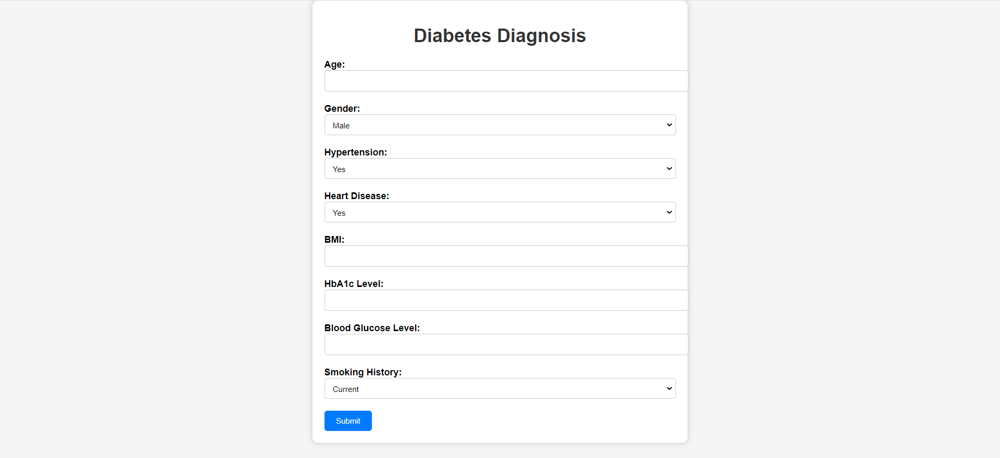

# Diabetes Prediction Project

This project focuses on predicting whether a person has diabetes or not based on various factors. It includes a dataset file `diabetes_prediction_dataset.csv` and a Jupyter Notebook file `notebook.ipynb` which contains the code and analysis.

## Dataset

The dataset file `diabetes_prediction_dataset.csv` contains 100,000 rows and 9 columns with the following column names:

1. gender: Three unique values - male, female, other.
2. age: Age of the individual.
3. hypertension: Binary value (0 or 1) indicating the presence of hypertension.
4. heart_disease: Binary value (0 or 1) indicating the presence of heart disease.
5. smoking_history: Six unique values - never, no info, current, former, ever, not current.
6. bmi: Body Mass Index (BMI) of the individual.
7. HbA1c_level: Level of HbA1c (glycated hemoglobin) in the blood.
8. blood_glucose_level: Blood glucose level of the individual.
9. diabetes: Binary value (0 or 1) indicating the presence of diabetes.

## Notebook

The Jupyter Notebook file `notebook.ipynb` contains the code and analysis for the diabetes prediction project. Here is an overview of the steps performed in the notebook:

1. Importing required libraries.
2. Importing the `diabetes_prediction_dataset.csv` file.
3. Removing duplicated values from the dataset.
4. Data visualization:
   - Countplot of the count of individuals by smoking history.
   - Countplot of the count of individuals by smoking history and diabetes status.
   - Countplot of the count of individuals by gender.
   - Countplot of the count of individuals by gender and diabetes status.
   - Histogram of age distribution.
   - Box plot of age distribution by diabetes.
   - Countplot of the count of individuals by hypertension and diabetes status.
   - Countplot of the count of individuals by heart disease and diabetes status.
   - Box plot of BMI distribution by diabetes.
   - Box plot of HbA1c level distribution by diabetes.
   - Box plot of blood glucose level distribution by diabetes.
   - Correlation heatmap.
5. Performing one-hot encoding on the `gender` and `smoking_history` columns.
6. Concatenating the encoded columns with other columns (`age`, `hypertension`, `heart_disease`, `bmi`, `HbA1c_level`, `blood_glucose_level`) and saving the resulting dataframe in the variable `X`.
7. Normalizing `X` using MinMaxScaler.
8. Defining the target variable `y` as `df['diabetes']`.
9. Balancing the class values using SMOTE, as the count of 0 (non-diabetic) is 87,664 and the count of 1 (diabetic) is 8,482.
10. Defining a dictionary of algorithms in the `algos` variable.
11. Training the algorithms with different hyperparameters and saving the model, best score, and best parameters in the `scores` variable.
12. Converting the `scores` into a dataframe.
13. Splitting the data of `X` and `y` into training, testing, and validating datasets using `train_test_split`.
14. Training a Random Forest Classifier with `n_estimators=100` and `criterion='entropy'`.
15. Calculating the accuracy score.
16. Predicting the values for the test data `X_valid` and saving the predictions in `y_pred`.
17. Creating a confusion matrix and heatmap of the confusion matrix.
18. Creating a classification report.
19. Applying PCA (Principal Component Analysis) on `X` for dimensionality reduction.
20. Training the model again with the Random Forest Classifier using the same parameters.
21. Creating a confusion matrix and classification report based on the reduced dimensions.

Please refer to the `notebook.ipynb` file for detailed code implementation and further analysis of the diabetes prediction project.

## Deployment Model

To deploy the diabetes prediction model, we have trained a Random Forest Classifier on the dataset. The trained model has been saved as `model.pickle` for later use in the web application.

You can find the code for training the model in the `deployment_model.ipynb` notebook.

## Flask Web Application

We have created a Flask web application for diabetes prediction using the trained Random Forest Classifier model. The application includes the following files:

1. `app.py`: This is the main Flask application file that handles routing and prediction.
2. `requirements.txt`: Contains the list of Python packages and dependencies required to run the Flask application.
3. `templates` directory: Contains the HTML templates for the web pages:
   - `index.html`: The main page for entering user data and getting predictions.
   - `true.html`: Displayed when the prediction result is "Diabetic."
   - `false.html`: Displayed when the prediction result is "Non-Diabetic."

To run the Flask web application, make sure you have the required dependencies installed as mentioned in `requirements.txt`, and then execute `app.py`.

Feel free to explore the web application and make predictions based on the trained model.

## Webpage Glimpse:

